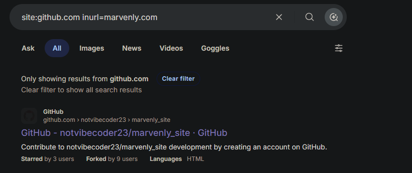
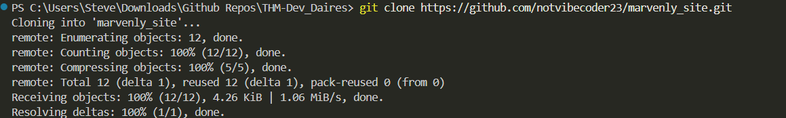
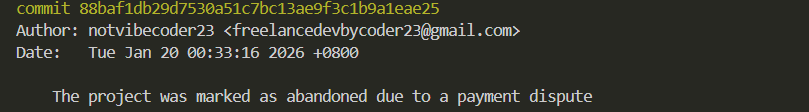
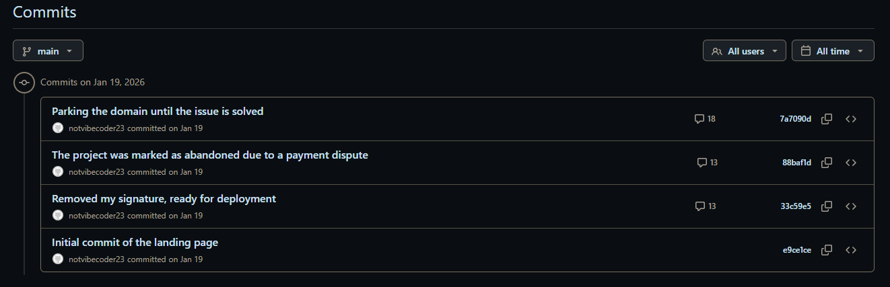
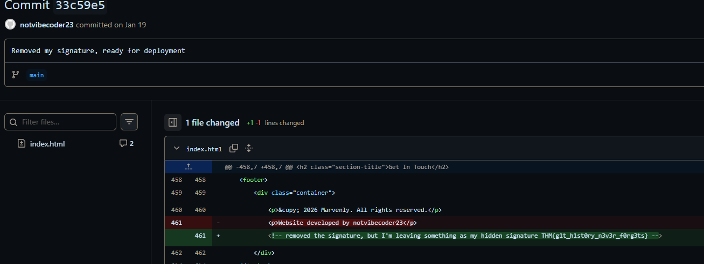

<div style="display: flex; align-items: center; gap: 10px;">
  
  <h1>THM-DEV_DIARIES-WKT</h1>
</div>
We have just launched a website developed by a freelance developer. The source code was not shared with us, and the developer has since disappeared without handing it over.

Despite this, traces of the development process and earlier versions of the website may still exist online.

You are only given the website's primary domain as a starting point: marvenly.com

--------------------------
### Question 1
 **What is the subdomain where the development version of the website is hosted?**

 Using the same **google dorking** use the command

 ```
 site:*.marvenly.com
 ```


 * *site* : this is to specify the site yu want to search <br>
 * *inurl* : specifies the content that should be present in the search<br>
 * The *  specifies we want every site marvenly.com as a domain.

 Answer : **uat-testing.marvenly.com**


### Question 2 
 This question states that **What is the Github user name of the Developer** and to get that i made use of an OSINT format called
 **Google Dorking** 

 With this command
 ```
 site:github.com inurl=marvenly.com
 ```


 *  *site* : this is to specify the site yu want to search <br>
 * *inurl* : specifies the content that should be present in the search <br>

Answer : **Notvibcoder23**

### Question 3
**What is the developer's email address?**
 
 To get the Email of the user we would need to check the git log and to do that we need to 

 ``` 
 git clone https://github.com/notvibecoder23/marvenly_site.git
 ```

 then 

 ```
 git log 
 ```


Answer : freelancedevbycoder23@gmail.com

### Question 4
**What reason did the developer mention in the commit history for removing the source code? ?**

 

 click on **commit** as shown above 



From the image above it is very obvious why the developer removed the source code and personally i agree.😁

 Answer : **The project was marked as abandoned due to a payment dispute**

### Question 5
 **What is the value of the hidden flag?**
 
 still using the image above click **Removed my signature, ready for deployment** then your flag should be there in the old THM fashion.

 

 Answer🚩 : **THM{g1t_h1st0ry_n3v3r_f0rg3ts}**

______

<center>Thank you, unto the next 🤞</center>
